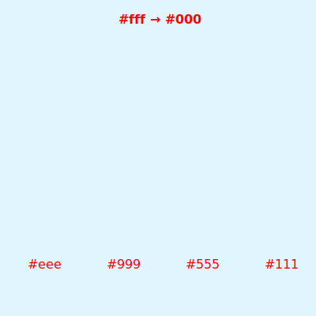

# SVG 之 clipPath 和 mask

本文主要介绍 `<clipPath>` 与 `<mask>` 元素。

## `<clipPath>`

`<clipPath>` 元素主要用于制作剪切效果。首先来看看如何定义 `<clipPath>`：

```html
  <defs>
    <!-- 定义 -->
    <clipPath id="clip">
      <rect x="100" y="50" width="200" height="100" />
    </clipPath>
  </defs>
```

上述代码定义了一个位于`x="100"`、`y="50"`，`width="200"`、`height="100"` 大小的矩形剪切区域。表示 **该区域以外的都会被剪裁**。定义好了 `<clipPath>`，那如何引用呢？

```html
<!-- 引用 clipPath -->
<circle cx="200" cy="150" r="100" clip-path="url(#clip)" fill="red" />
```
通过 `clip-path` 特性就可以引用刚定义的 `<clipPath>`。


上图中 **红虚线矩形框** 表示 `<clipPath>` 剪切区域；**暗红区域** 表示被剪切的区域；**红色区域** 表示显示区域；

### clipPathUnits

用于决定 `<clipPath>` 元素内的内容的 `x`、`y`、`width`、`height` 如何计算。有如下两种取值：

- objectBoundingBox：相对于引用元素的宽、高计算。

- userSpaceOnUse：绝对值，即直接使用设定的值。默认值。

与 `<pattern>` 元素的 `patternContentUnits` 特性类似。

```html
  <defs>
    <clipPath id="clip" clipPathUnits="objectBoundingBox">
      <rect class="c" x="0" y="0" width="1" height="1" />
    </clipPath>
  </defs>

  <circle cx="200" cy="150" r="100" clip-path="url(#clip)" fill="red" />
```

## `<mask>`

`<mask>` 元素主要用于制作遮罩效果。`<mask>` 与 `<clipPath>` 都是用于控制图形如何显示。与 `<clipPath>` 不同在于 `<mask>` 则根据定义的灰度来控制透明度。简单点说：**越黑越透明，越白越不透明。只有作用于灰度，如果是彩色也会换算为对应的灰度。**

```html
  <defs>
    <!-- 定义 mask -->
    <mask id="mask" x="100" y="50" width="200" height="200" fill="#fff" maskContentUnits="objectBoundingBox" maskUnits="userSpaceOnUse" >
      <rect class="r" x="0" y="0" width="1" height="1" />
    </mask>
  </defs>
  <!-- 引用 mask -->
  <circle cx="200" cy="150" r="100" mask="url(#mask)" fill="red" />
```



因为 `<mask>` 元素作用于灰度，所以渐变灰度也是可以的。

```html
<defs>
  <linearGradient id="gradient">
    <stop offset="0" stop-color="#fff" stop-opacity="0" />
    <stop offset="1" stop-color="#fff" stop-opacity="1" />
  </linearGradient>
  <mask id="mask">
    <rect x="100" y="100" width="200" height="200" fill="url(#gradient)"  />
  </mask>
</defs>
<rect x="0" y="0" width="400" height="400" fill="#E1F5FE" />
```


### maskUnits 与 maskContentUnits

与 `<pattern>` 元素的 `patternUnits` 与 `patternContentUnits` 特性类似。不了解请求参考对应的文章：[svg 之 pattern](../svg之pattern/svg之pattern.md#patternUnits)

