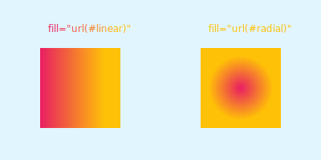
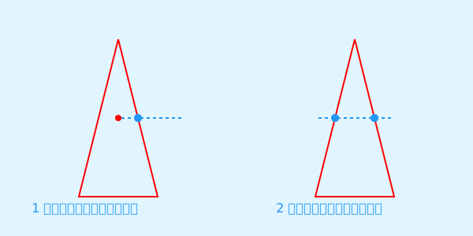

# SVG 之 fill 及 fill-rule

SVG 中的 `fill` 特性可用于路径填充。路径填充不仅可以填充颜色，还可以填充图案。对于一些不规则的填充，还需要结合 `fill-rule`。

## 填充颜色

- 纯颜色

  

- 渐变颜色

  除了可以填充纯颜色，还可以填充渐变颜色。要填充渐变颜色，首先得使用`<linearGradient></linearGradient>`、`<radialGradient></radialGradient>`定义渐变颜色。

  ```html
  <defs>
    <linearGradient id="linear">
      <stop offset="0%" stop-color="#e91e63" />
      <stop offset="80%" stop-color="#ffc107" />
    </linearGradient>
    <radialGradient id="radial">
      <stop offset="0%" stop-color="#e91e63"/>
      <stop offset="80%" stop-color="#ffc107"/>
    </radialGradient>
  </defs>
  ```

  再通过 `fill` 进行引用

  ```html
    <rect x="50" y="60" width="100" height="100" fill="url(#linear)"/>
    <rect x="250" y="60" width="100" height="100" fill="url(#radial)"/>
  ```

  

## 填充图案
  
与渐变颜色一样，要填充图案，也要先定义。SVG 中可以使用 `<pattern></pattern>` 进行图案定义。

```html
<defs>
  <pattern id="pattern1" patternUnits="userSpaceOnUse" x="0" y="0" width="24" height="24">
    <rect x="0" y="0" width="20" height="20" fill="#03A9F4"></rect>
  </pattern> 
  <pattern id="pattern2" patternUnits="userSpaceOnUse" fill="#03A9F4" x="0" y="0" width="30" height="30">
    <circle cx="10" cy="10" r="10"/>
  </pattern> 
</defs>
```
再通过 `fill` 进行引用

```html
  <rect x="50" y="60" width="100" height="100" fill="url(#pattern1)"/>
  <rect x="250" y="60" width="100" height="100" fill="url(#pattern2)"/>
```


对于一些不规则的填充，该如何处理呢？如下图五角星填充。中心不填充颜色，五角填充颜色。


要实现上图的颜色填充，需要借助 SVG 的 `fill-rule`。

## `fill-rule`

路径填充规则，有如下两种规则：

- `nonzero`：非零规则。即非零则内部，填充；零则外部，不填充。


- `evenodd`：奇偶规则。即奇数则内部，填充；偶数则外部，不填充。

那如何应用这两种规则呢？要判断某个区域是否在路径内，只需在该区域内找任意一个点，以这个点为起点，发射一条射线。

- `nonzero` 规则：初始值为 0，计算射线与路径段的相交情况。如果相交路径段是从左向右就加 1，从右向左就减 1。如果结果数值不为 0，则在路径内。如果为 0，则在路径外。

  

- `evenodd` 规则：初始值为 0，计算射线与路径段的相交数。如果相交数为奇数，则在路径内。如果为偶数，则在路径外。

  


介绍完 `fill-rule`，再来看看如何填充五角星。要实现这种填充就得用到刚介绍的 `evenodd` 规则。

  

如上示意图所示。中心区域的任何点发射的射线，与五角星路径段的相交数为偶数，所以在路径外。而五角区域的任何点发射的射线与五角星路径段的相交数为奇数，所以在路径内。再来看看应用 `nonzero` 规则，结果会怎样呢？

  

中心区域的任何点发射的射线，与五角星相交的路径段的方向都为左向右，结果数值为2，即不为零，在路径内。同样五角区域的任何点发射的射线与五角星相交的路径段的方向也都为左向右，结果数值为1，即不为零，在路径内。