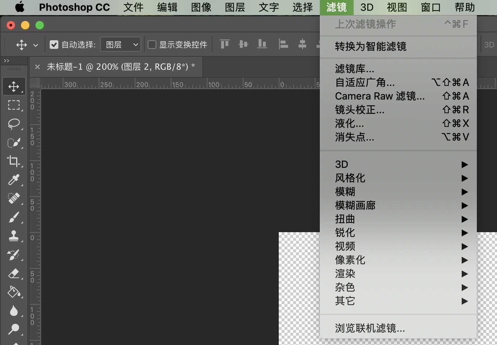
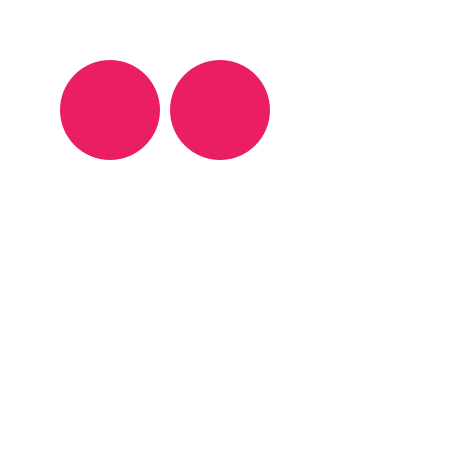

## SVG 之 filter



用过 Photoshop 的小伙伴应该对滤镜不陌生。滤镜可用来做一些特殊化效果处理，功能很强大。SVG 也是一种图形格式，滤镜功能怎么能少呢。

滤镜：filter，是 SVG 中一个很重要的特性。因为它可以让 SVG 的表现力更加强大。

```html
<!-- 定义 feGaussianBlur 滤镜 #blur-->
<filter id="blur" height="0.5">
  <feGaussianBlur stdDeviation="6" />
</filter>

<circle cx="60" cy="60" r="50" fill="#E91E63" />
<!-- 引用 #blur -->
<circle cx="170" cy="60" r="50" fill="#E91E63" filter="url(#blur)" />
```



## filterUnits

用于决定 filter 的 `x`、`y`、`width`、`height` 的如何计算。有如下两种取值：

- objectBoundingBox：相对于引用元素的宽、高计算。默认值。

- userSpaceOnUse：绝对值，即直接使用设定的值。

当 `patternUnits="userSpaceOnUse"` 时， `x`、`y`、`width`、`height` 直接使用设定的值；当 `patternUnits="objectBoundingBox"` 时， `x`、`y`、`width`、`height` 设定的值是 **比例值**，需要根据引用元素的宽高进行计算。其中 `x`、`width` 参考引用元素的宽 `w1`，`y`、`height` 参考引用元素的高 `h1`。

## primitiveUnits

与 `filterUnits` 类似，只是作用对象不同。`filterUnits` 作用于 filter 元素，而 `primitiveUnits` 作用于 filter 元素内的内容。另外，还有一个不同点，`filterUnits` 的默认值为 `objectBoundingBox`，而 `primitiveUnits` 默认值为 `userSpaceOnUse`。

## 滤镜列表

- feBlend：根据特定的混合模式将两个对象组合在一起。类似于 **PS** 中的混合模式。
- feColorMatrix：根据转换矩阵更改颜色。
- feComponentTransfer：每个像素执行颜色分量数据的重新映射。 它允许进行诸如亮度调节，对比度调节，色彩平衡或阈值设置之类的操作。
  - feFuncR
  - feFuncG
  - feFuncB
  - feFuncA
- feComposite：混合图片，可以按百分比的方式进行混合。
- feConvolveMatrix：矩阵卷积计算。能计算出模糊，边缘检测，锐化，浮雕和斜角等效果。
- feDisplacementMap：位置替换滤镜。即改变元素和图形的像素位置。
- feDiffuseLighting：使用 alpha 通道作为凹凸贴图来照亮图像。
- feSpecularLighting：使用 alpha 通道作为凹凸贴图来照亮源图形。
- fePointLight：定义光源，该光源可以创建点光源效果。
- feSpotLight：定义光源，该光源可以创建聚光灯效果。
- feSpotLight：定义光源，该光源可以创建聚光灯效果。
- feFlood：使用 `flood-color` 和 `flood-opacity` 定义的颜色和不透明度填充滤镜子区域。
- feGaussianBlur：高斯模糊。
- feImage：插入一张图片成为滤镜。
- feMerge：不同滤镜的组合
  - feMergeNode
- feMorphology：用于腐蚀或扩大输入图像，它的作用尤其在于增脂或稀疏效果。
- feOffset：移动引用滤镜的元素的位置。
- feTile：使用输入图像的重复平铺图案填充目标矩形。 效果类似于 `<pattern>`。
- feTurbulence：创建震荡与纹理。
