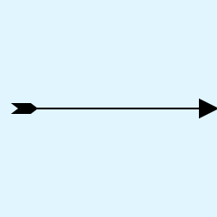
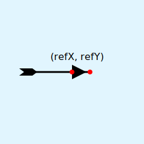
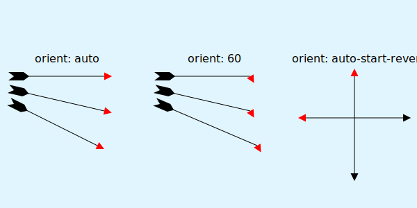
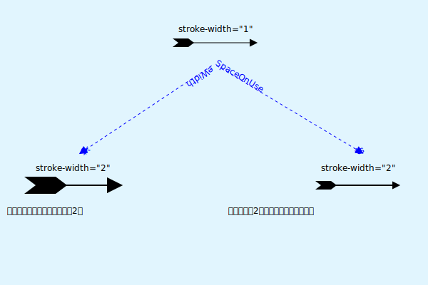

# svg 之 marker

如何使用 SVG 绘制一支 **弓箭** ?



 绘制难点在于如何处理箭头和箭羽。要解决这个问题，就得借助 **marker 元素**。

## 定义

**marker 元素**，顾名思义，用于标记 [path](https://developer.mozilla.org/en-US/docs/Web/SVG/Element/path)、[line](https://developer.mozilla.org/en-US/docs/Web/SVG/Element/line)、[polyline](https://developer.mozilla.org/en-US/docs/Web/SVG/Element/polyline) 或 [polygon](https://developer.mozilla.org/en-US/docs/Web/SVG/Element/polygon) 元素的顶点（起点、终点等）。它是一种引用元素。即定义时不会显示，在被引用时才会显示。因此，最好将其定义在 `<defs>` 标签内。

```html
<defs>
  <marker>
  <!-- 定义marker -->
  </marker>
</defs>
```

## 属性

- id

  通过 `"id"` 来引用对应的 marker 元素

  ```html
  <defs id="arrow">
    <marker>
    <!-- 定义marker -->
    </marker>
  </defs>
  ```
- markerWidth 与 markerHeight

  指定 marker 元素的 **viewport** 的宽和高。默认值 `markerWidth: 3` , `markerHeight: 3`。

  ```html
  <defs >
    <marker markerWidth="30" markerHeight="12">
    <!-- 定义marker -->
    </marker>
  </defs>
  ```

- refX 与 refY

  指定 marker 元素的 **引用 x、y 坐标**。用于与被引用元素的顶点。
  
  - refX：left|center|right 或 坐标数值。默认值为 0。
  - refY：top|center|bottom 或 坐标数值。默认值为 0。
  

  ```html
  <defs >
    <marker refX="left" refY="center">
    <!-- 定义marker -->
    </marker>
  </defs>
  ```
  

- orient
  
  指定 marker 的方向，默认值为 0。

  - auto：以 X 轴的方向为起始方向，旋转到路径的方向上。
  - auto-start-reverse：如果以 `marker-start` 引用 marker 元素，则旋转 180 度。 其他则以 `auto` 一样。
  - 弧度：以 X 轴的方向为起始方向，旋转到指定的弧度。
  
  

- markerUnits

  用于确定 marker 坐标系统的使用单位。默认值 `"strokeWidth"`。

  - strokeWidth：相对于`stroke-width`进行计算。
  
  - userSpaceOnUse：绝对单位。

  
- viewBox 与 preserveAspectRatio

  关于 viewBox 与 preserveAspectRatio 已做过相关介绍，可以参考之前文章：[svg之viewBox](./svg之viewBox/svg之viewBox.md)。

## 引用

- marker-start="url(#marker-id)"：引用 marker 元素与路径的起点对齐。
- marker-mid="url(#marker-id)" 引用 marker 元素与除起点、终点外的其他顶点对齐。
- marker-end="url(#marker-id)"：引用 marker 元素与路径的终点对齐。


## 参考文章

- [How To Create SVG Arrowheads and Polymarkers — The marker Element](https://vanseodesign.com/web-design/svg-markers/)
