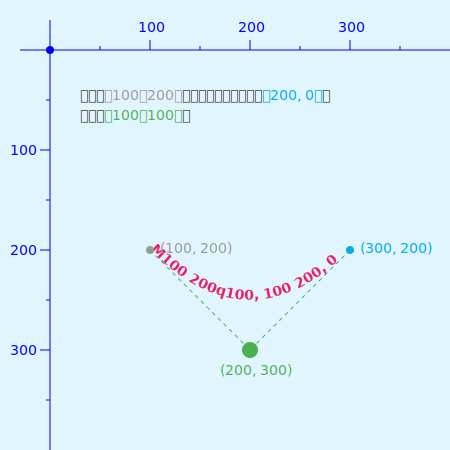
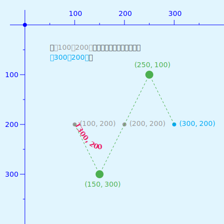
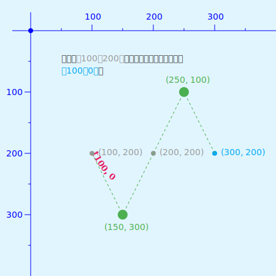
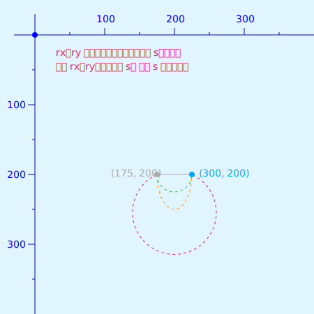
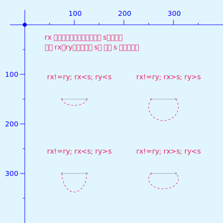

# svg 之 path

path 元素是 SVG 重要组成部分，可以说了解 path，基本上就掌握了 SVG。因为基本上大部分图形都可以 path 来实现。SVG 的基本图形，其底层都是用 path 元素来实现的。并且 path 还可以实现炫酷的描边动画，想了解描边动画可以参阅之前文章 😀。

path 元素通过属性 **"d"** 定义形状，属性 **"d"** 的值是一个 **“命令 + 参数”** 的序列。

| 命令  | 参数                                                | 说明                                                                                                                                                                                                                                                                                |
| ----- | --------------------------------------------------- | ----------------------------------------------------------------------------------------------------------------------------------------------------------------------------------------------------------------------------------------------------------------------------------- |
| M (m) | x y                                                 | **移动到（Move to）** 路径的起始点`（x, y）`                                                                                                                                                                                                                                          |
| L (l) | x y                                                 | 从当前点 **画直线到（Line to）** 指定点`（x, y）`                                                                                                                                                                                                                                   |
| H (h) | x                                                   | 从当前点 **画水平直线到（Horizontal line to）** 指定的 `x`                                                                                                                                                                                                                       |
| V (v) | y                                                   | 从当前点 **画水平直线到（Vertical line to）** 指定的 `y`                                                                                                                                                                                                                         |
| C (c) | x1 y1 x2 y2 x y                                     | 从当前点 **画贝塞尔曲线到（Curve to）** 指定点的`（x, y）`，其中`（x1, y1）`，`（x2, y2）` 为控制点                                                                                                                                                                                 |
| S (s) | x2 y2 x y                                           | 从当前点 **画反射贝塞尔曲线到（Smooth curve to）** 指定点的`（x, y）`，其中`（x2, y2）` 为控制点                                                                                                                                                                                    |
| Q (q) | x1 y1 x y                                           | 从当前点 **画二次贝塞尔曲线到（Quadratic Bézier curve to）** 指定点的`（x, y）`，其中`（x1, y1）` 为控制点                                                                                                                                                                          |
| T (t) | x y                                                 | 从当前点 **画反射二次贝塞尔曲线到（Smooth Quadratic Bézier curve to）** 指定点的`（x, y）`                                                                                                                                                                                          |
| A (a) | rx ry x-axis-rotation large-arc-flag sweep-flag x y | 从当前点 **画个椭圆形到（elliptical Arc）** 指定点的`（x, y）`。其中`（rx, ry）`为椭圆形的 x 轴及 y 轴的半径，`x-axis-rotation` 是弧线与 x 轴的旋转角度，`large-arc-flag=1` 最大角度的弧线，`large-arc-flag=0` 最小角度的弧线；`sweep-flag=1` 顺时针方向，`sweep-flag=0` 逆时针方向 |
| Z (z) |                                                     | **闭合路径(close path)**，将当前点与第一个点连接起来                                                                                                                                                                                                                                |

**⚠️ 大写（M）表示绝对定位，小写（m）表示相对定位。**

## 命令

- M / m
  `M x y`： 移动到点`（x, y）`。即相对于坐标原点进行移动

  

  `m dx dy`： 相对于当前坐标点移动 `(dx, dy)` 的距离

  

- L / l
  
  `L x y`：从当前点 **画直线到（Line to）** 指定点`（x, y）`
  
  

  `l dx dy`：相对于当前点 **画直线到（Line to）** `(dx dy)` 的距离
  
  

- H / h

  `H x`：从当前点 **画水平直线到（Horizontal line to）** 指定的 `x`
  
  

  `h dx`：相对于当前点 **画水平直线到（Horizontal line to）** `dx` 的距离
  
  

- V / v
  
  `V y`：从当前点 **画水平直线到（Vertical line to）** 指定的 `y`
  
  

  `v dy`：相对于当前点 **画水平直线到（Vertical line to）** `dy` 的距离
  
  

- C / c
  `C x1, y1 x2, y2 x, y`：从当前点 **画贝塞尔曲线到（Curve to）** 指定点的`（x, y）`，其中`（x1, y1）`，`（x2, y2）` 为控制点
  
  

  `c dx1, dy1 dx2, dy2 dx, dy`：相对于当前点 **画贝塞尔曲线到（Curve to）** `（dx, dy）` 的距离，其中`（dx1, dy1）`，`（dx2, dy2）` 为控制点距当前点的距离
  
  

- S / s（与 C / c）配合使用
  
  `S x2, y2 x, y`：从当前点 **画反射贝塞尔曲线到（Smooth curve to）** 指定点的`（x, y）`，其中`（x2, y2）` 为控制点
  
  

  `s dx2, dy2 dx, dy`：相对于当前点 **画反射贝塞尔曲线到（Smooth curve to）** `（dx, dy）` 的距离，其中`（dx2, dy2）` 为控制点距当前点的距离

  

- Q / q
  
  `Q x1, y1 x, y`：从当前点 **画二次贝塞尔曲线到（Quadratic Bézier curve to）** 指定点的`（x, y）`，其中`（x1, y1）` 为控制点
  
  

  `q dx1, dy1 dx, dy`：相对于当前点 **画二次贝塞尔曲线到（Quadratic Bézier curve to）** `（dx, dy）` 的距离，其中`（dx1, dy1）` 为控制点距当前点的距离
  
  

- T / t（与 Q / q）配合使用
  
  `T x y`：从当前点 **画反射二次贝塞尔曲线到（Smooth Quadratic Bézier curve to）** 指定点的`（x, y）`
  
  

  `t dx dy`：相对于当前点 **画反射二次贝塞尔曲线到（Smooth Quadratic Bézier curve to）** `（dx, dy）` 的距离
  
  

- A / a
  `A (a) rx ry x-axis-rotation large-arc-flag sweep-flag x y` 命令是 `d` 所有命令中最复杂的。为了好理解，这里对参数分开讲解。
  - rx ry
    `rx`为椭圆弧的 x 轴半径，`ry` 为椭圆的 y 轴半径。当 `rx` 小于当前点距终点`x y`的距离 `s` 时，则 `rx` 与 `ry` 会按 `s` 进行换算。反之则直接使用`rx` 与 `ry`。

    
    
    
    
    从上图可知，`rx` 取值为 `Max(s, rx)`。如果 `rx` 没有根据 `s` 换算，则 `ry` 直接使用，否则按与 `rx` 比例关系进行换算。上述结论是基于 `x-axis-rotation: 0` 得出的。
  - x-axis-rotation
    `x-axis-rotation`表示弧线与 x 轴的夹角

    

    从图可知夹角可以取负值。当值小于 0 时方向与相等的正值相反。
  
  - large-arc-flag 与 sweep-flag
    `large-arc-flag=1` 为最大角度的弧线，`large-arc-flag=0` 为最小角度的弧线；`sweep-flag=1` 表示顺时针方向，则`sweep-flag=0` 表示逆时针方向。
    
    
