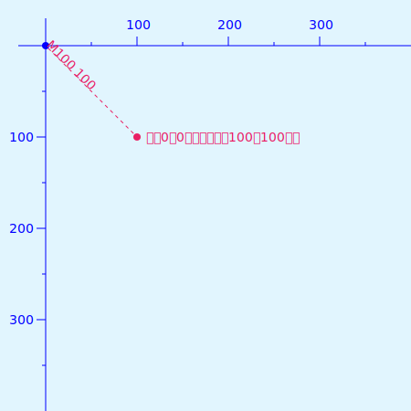
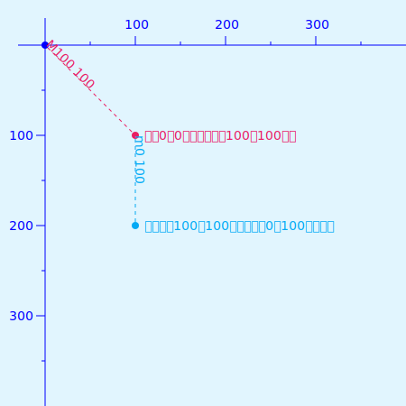
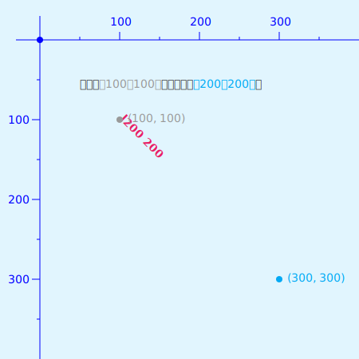
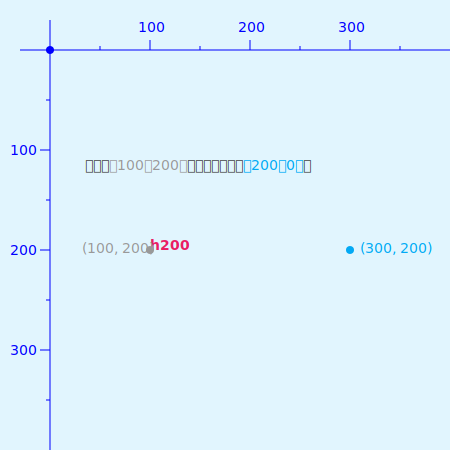
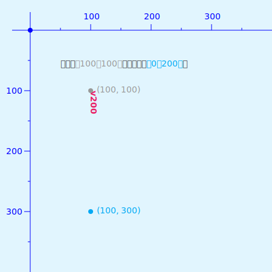
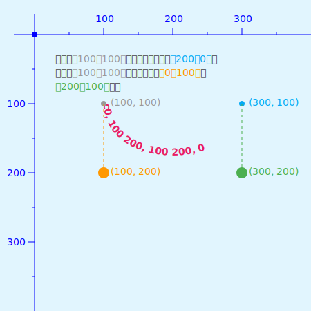
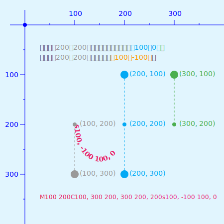

# svg 之 path

path 元素是 SVG 重要组成部分，可以说了解 path，基本上就掌握了 SVG。因为基本上大部分图形都可以 path 来实现。SVG 的基本图形，其底层都是用 path 元素来实现的。并且 path 还可以实现炫酷的描边动画，想了解描边动画可以参阅之前文章 😀。

path 元素通过属性 **"d"** 定义形状，属性 **"d"** 的值是一个 **“命令 + 参数”** 的序列。

| 命令  | 参数                                                | 说明                                                                                                                                                                                                                                                                                |
| ----- | --------------------------------------------------- | ----------------------------------------------------------------------------------------------------------------------------------------------------------------------------------------------------------------------------------------------------------------------------------- |
| M (m) | x y                                                 | **移动到（Move to）** 路径起始点`（x, y）`                                                                                                                                                                                                                                          |
| L (l) | x y                                                 | 从当前点 **画直线到（Line to）** 指定点`（x, y）`                                                                                                                                                                                                                                   |
| H (h) | x                                                   | 从当前点 **画水平直线到（Horizontal line to）** 指定的 `x` 轴                                                                                                                                                                                                                       |
| V (v) | y                                                   | 从当前点 **画水平直线到（Vertical line to）** 指定的 `y` 轴                                                                                                                                                                                                                         |
| C (c) | x1 y1 x2 y2 x y                                     | 从当前点 **画贝塞尔曲线到（Curve to）** 指定点的`（x, y）`，其中`（x1, y1）`，`（x2, y2）` 为控制点                                                                                                                                                                                 |
| S (s) | x2 y2 x y                                           | 从当前点 **画反射贝塞尔曲线到（Smooth curve to）** 指定点的`（x, y）`，其中`（x2, y2）` 为控制点                                                                                                                                                                                    |
| Q (q) | x1 y1 x y                                           | 从当前点 **画二次贝塞尔曲线到（Quadratic Bézier curve to）** 指定点的`（x, y）`，其中`（x1, y1）` 为控制点                                                                                                                                                                          |
| T (t) | x y                                                 | 从当前点 **画反射二次贝塞尔曲线到（Smooth Quadratic Bézier curve to）** 指定点的`（x, y）`                                                                                                                                                                                          |
| A (a) | rx ry x-axis-rotation large-arc-flag sweep-flag x y | 从当前点 **画个椭圆形到（elliptical Arc）** 指定点的`（x, y）`。其中`（rx, ry）`为椭圆形的 x 轴及 y 轴的半径，`x-axis-rotation` 是弧线与 x 轴的旋转角度，`large-arc-flag=1` 最大角度的弧线，`large-arc-flag=0` 最小角度的弧线；`sweep-flag=1` 顺时针方向，`sweep-flag=0` 逆时针方向 |
| Z (z) |                                                     | **闭合路径(close path)**，将当前点与第一个点连接起来                                                                                                                                                                                                                                |

**⚠️ 大写（M）表示绝对定位，小写（m）表示相对定位。**

## 命令

- M / m
  `M` 绝对移动即相对于坐标原点

  

  `m` 相对移动即相对于当前坐标点

  

- L / l
  
  `L`
  
  

  `l`
  
  

- H / h
  `H`
  
  

  `h`
  
  

- V / v
  `V`
  
  

  `v`
  
  

- C / c
  `C`
  
  

  `c`
  
  

- S / s
  `S`
  
  

  `s`
  
  