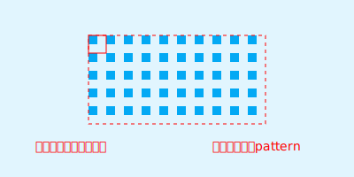
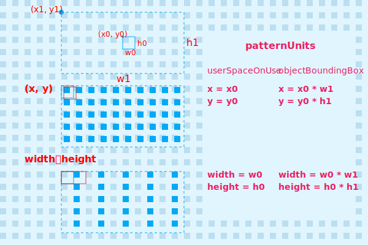
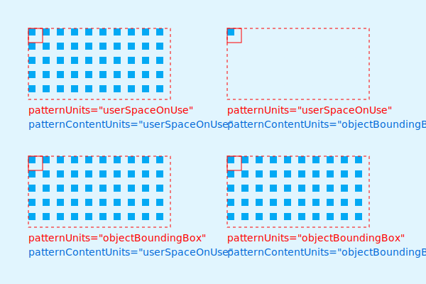
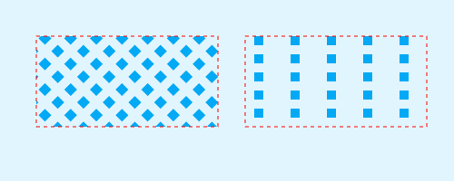
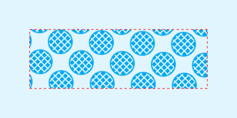

# SVG 之 pattern

`<pattern>` 是 SVG 中用于设置填充图案的元素。与背景图片填充最大区别在于，pattern能自己定义图案，而背景填充需要提前准备填充图片。


上图是 `<pattern>` 元素实现的填充效果图。我们来看看是怎么实现的。

```html
  <defs>
    <!-- 定义图案 -->
    <pattern id="pattern1" x="0" y="0" width="0.1" height="0.2" >
      <rect x="0" y="0" width="10" height="10" fill="#03A9F4"></rect>
    </pattern> 
  </defs>
  <!-- 引用图案填充 -->
  <rect x="0" y="0" width="200" height="100" fill="url(#pattern1)" />
```


在定义图案时，指定 `x`、`y`、`width`、`height` 都是 **比例值**。因为这主要受 `patternUnits` 特性的影响。那什么是 `patternUnits`?

## patternUnits

用于决定 pattern 的 `x`、`y`、`width`、`height` 的如何计算。有如下两种取值：

- objectBoundingBox：相对于引用元素的宽、高计算。默认值。

- userSpaceOnUse：绝对值，即直接使用设定的值。



从上图可知，当 `patternUnits="userSpaceOnUse"` 时， `x`、`y`、`width`、`height` 直接使用设定的值；当 `patternUnits="objectBoundingBox"` 时， `x`、`y`、`width`、`height` 设定的值是 **比例值**，需要根据引用元素的宽高进行计算。其中 `x`、`width` 参考引用元素的宽 `w1`，`y`、`height` 参考引用元素的高 `h1`。

`patternUnits` 的计算原理介绍完了。来个实例演示一下两种取值的实现效果。


```html
<defs>
  <!-- userSpaceOnUse -->
  <pattern id="pattern1" patternUnits="userSpaceOnUse" x="0" y="0" width="20" height="20" >
    <rect width="10" height="10" fill="#03A9F4"></rect>
  </pattern>
  <!-- objectBoundingBox -->
  <pattern id="pattern2" patternUnits="objectBoundingBox" x="0" y="0" width="0.1" height="0.2" >
    <rect width="10" height="10" fill="#03A9F4"></rect>
  </pattern> 
</defs>
<!-- 引用 pattern1 -->
<rect x="60" y="40" width="200" height="100" fill="url(#pattern1)"/>
<!-- 引用 pattern2 -->
<rect x="320" y="40" width="200" height="100" fill="url(#pattern2)"/>
```

## patternContentUnits

与 `patternUnits` 类似，只是作用对象不同。`patternUnits` 作用于 pattern 元素，而 `patternContentUnits` 作用于 pattern 元素内的内容。另外，还有一个不同点，`patternUnits` 的默认值为 `objectBoundingBox`，而 `patternContentUnits` 默认值为 `userSpaceOnUse`。



```html
<defs>
  <!-- patternUnits="userSpaceOnUse" patternContentUnits="userSpaceOnUse" -->
  <pattern id="pattern1" patternUnits="userSpaceOnUse" patternContentUnits="userSpaceOnUse" x="0" y="0" width="20" height="20" >
    <rect width="10" height="10" fill="#03A9F4"></rect>
  </pattern> 
  <!-- patternUnits="userSpaceOnUse" patternContentUnits="objectBoundingBox" -->
  <pattern id="pattern2" patternUnits="userSpaceOnUse" patternContentUnits="objectBoundingBox" x="0" y="0" width="20" height="20" >
    <rect width="0.05" height="0.1" fill="#03A9F4"></rect>
  </pattern> 
  <!-- patternUnits="objectBoundingBox" patternContentUnits="userSpaceOnUse" -->
  <pattern id="pattern3" patternUnits="objectBoundingBox" patternContentUnits="userSpaceOnUse" x="0" y="0" width="0.1" height="0.2" >
    <rect width="10" height="10" fill="#03A9F4"></rect>
  </pattern> 
  <!-- patternUnits="objectBoundingBox" patternContentUnits="objectBoundingBox" -->
  <pattern id="pattern4" patternUnits="objectBoundingBox" patternContentUnits="objectBoundingBox" x="0" y="0" width="0.1" height="0.2" >
    <rect width="0.05" height="0.1" fill="#03A9F4"></rect>
  </pattern> 
</defs>
<!-- pattern1 -->
<rect x="40" y="40" width="200" height="100" fill="url(#pattern1)" stroke="red" stroke-dasharray="4"/>
<!-- pattern2 -->
<rect x="320" y="40" width="200" height="100" fill="url(#pattern2)" stroke="red" stroke-dasharray="4"/>
<!-- pattern3 -->
<rect x="40" y="220" width="200" height="100" fill="url(#pattern3)" stroke="red" stroke-dasharray="4"/>
<!-- pattern4 -->
<rect x="320" y="220" width="200" height="100" fill="url(#pattern4)" stroke="red" stroke-dasharray="4"/>
```

## patternTransform

类似于 `transform` 样式，专业用于 `pattern` 元素。与 `patternUnits` 和 `patternContentUnits` 结合可以制作一些惊艳的图案效果。


```html
<defs>
  <!-- 定义图案 -->
  <pattern id="pattern1" width="0.1" height="0.2" patternTransform="rotate(-45)" >
    <rect width="100" height="10" fill="#ff9800"></rect>
  </pattern> 
</defs>
<g>
  <rect x="0" y="0" width="200" height="100" fill="#141414" />
  <!-- 引用填充图案 -->
  <rect x="0" y="0" width="200" height="100" fill="url(#pattern1)" />
</g>
```

## `xlink:href` 复用

`pattern` 元素还提供了 `xlink:href` 特性用于 `pattern` 元素的复用。



```html
<defs>
  <pattern id="p" width="0.1" height="0.2" >
    <rect width="10" height="10" fill="#03A9F4"></rect>
  </pattern>
  <!-- 复用 pattern1 -->
  <pattern id="pattern1" xlink:href="#p" width="0.1" height="0.2" patternTransform="rotate(-45)" ></pattern> 
  <!-- 复用 pattern2 -->
  <pattern id="pattern2" xlink:href="#p" width="0.2" height="0.2" ></pattern> 
</defs>
<g>
  <rect x="0" y="0" width="500" height="200" fill="#E1F5FE" />
  <!-- 引用填充图案 pattern1 -->
  <rect x="40" y="40" width="200" height="100" fill="url(#pattern1)" stroke="red" stroke-dasharray="4"/>
  <!-- 引用填充图案 pattern2 -->
  <rect x="270" y="40" width="200" height="100" fill="url(#pattern2)" stroke="red" stroke-dasharray="4"/>
</g>
```

## 嵌套 pattern

`pattern` 元素可以支持 `pattern` 元素间的相互嵌套，用于组合图案效果。



```html
<defs>
  <pattern id="p" width="0.2" height="0.2" >
    <rect width="6" height="6" fill="#03A9F4"></rect>
  </pattern> 
  <pattern id="pattern1" xlink:href="#p" width="0.16" height="0.5" patternTransform="rotate(-45)">
    <!-- 嵌套 #p -->
    <circle cx="22" cy="22" r="20" fill="url(#p)" stroke="#03A9F4" stroke-width="2"/>
  </pattern> 
</defs>
<g>
  <rect x="0" y="0" width="400" height="200" fill="#E1F5FE" />
  <!-- 引用填充图案 pattern1 -->
  <rect x="50" y="50" width="300" height="100" fill="url(#pattern1)" stroke="red" stroke-dasharray="4"/>
</g>
```

## viewBox 与 preserveAspectRatio

`pattern` 元素也有自己的 viewBox 与 preserveAspectRatio 特性。关于 viewBox 与 preserveAspectRatio 已做过相关介绍，可以参考之前文章：[svg之viewBox](../svg之viewBox/svg之viewBox.md)。
