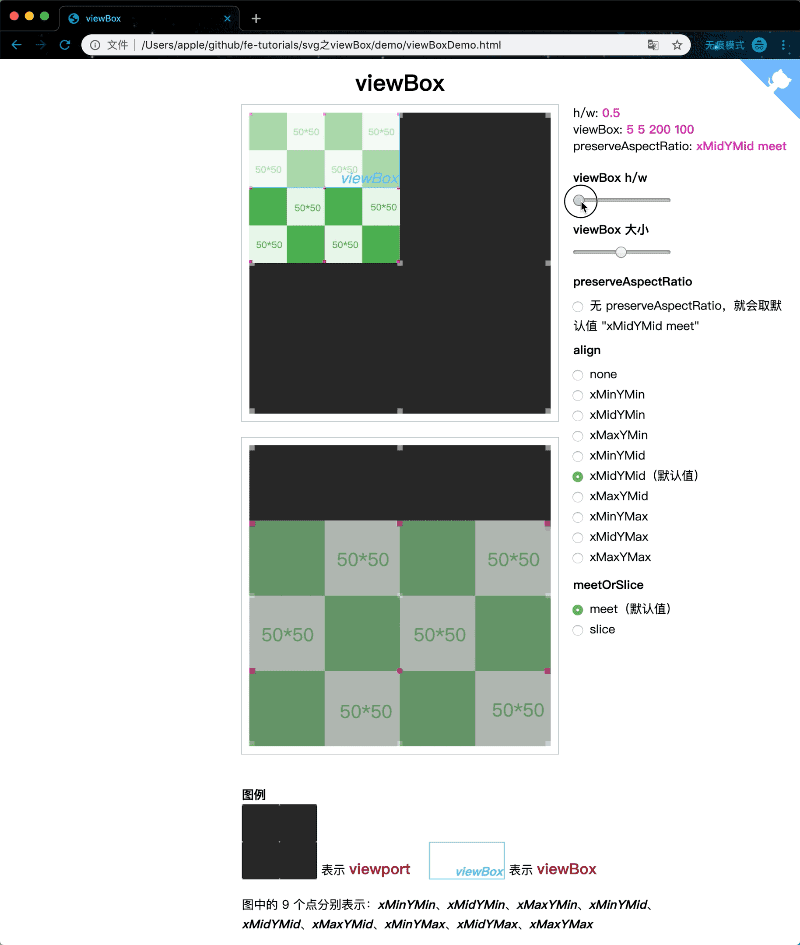
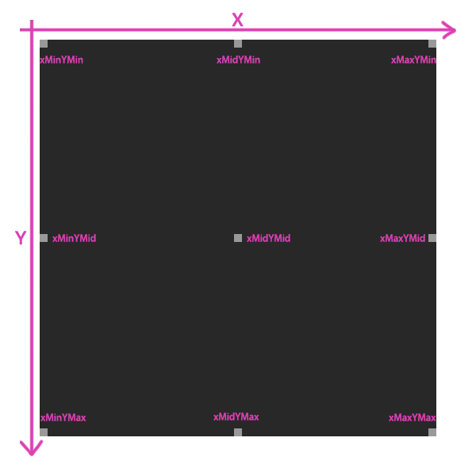
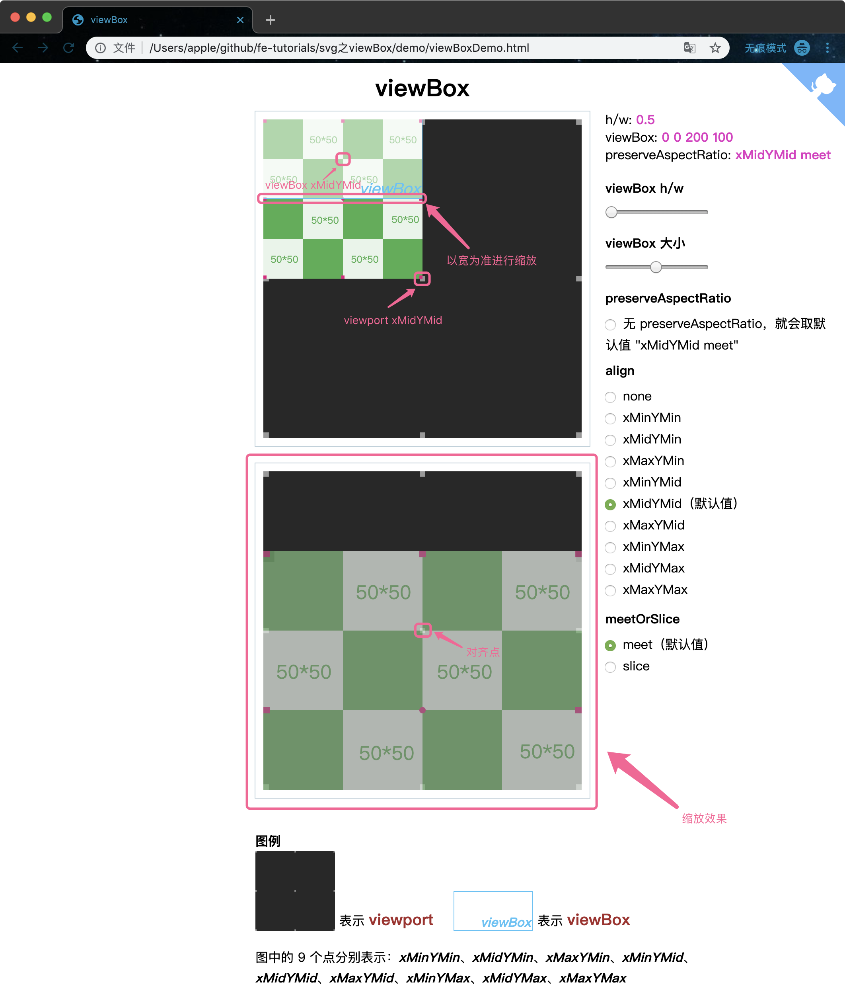

# 一个演示让你轻松了解 SVG viewBox 如何工作



[🎯 演示实例在线地址---> ⛳️](http://htmlpreview.github.io/?https://github.com/zhansingsong/fe-tutorials/blob/master/svg%E4%B9%8BviewBox/demo/viewBoxDemo.html)

## viewport

SVG 元素都有个 viewport，即视图窗口。viewport 的大小由 SVG 元素的大小决定。

```html
<!-- 默认单位 px -->
<svg width="200" height="200">
  <!-- 其它 svg 元素 -->
</svg>
```
如上 SVG 元素的 viewport 为 `200 * 200`。

## viewBox(min-x, min-y, width, height)

**视盒**，即 SVG 的可视范围。当不设定 `viewBox` 时，`viewBox` 等于 `viewport`。 当设定地 `viewBox` 时，SVG 会把 `viewBox` 设定区域缩放到 `viewport` 的大小。即 `viewBox`可以用于控制 SVG 内容如何显示。不是很好理解，来个演示：


🌴 [演示实例在线地址](http://htmlpreview.github.io/?https://github.com/zhansingsong/fe-tutorials/blob/master/svg%E4%B9%8BviewBox/demo/vb.html) 🌴

上述演示实例 `viewBox` 的宽高比刚好与 `viewport` 的一致。如果比例不一致会怎样呢？

## preserveAspectRatio(align, meetOrSlice)

在比例不一致的情况需要解决两个问题：

- `viewBox` 如何与 `viewport` 对齐
- `viewBox` 如何缩放

要解决上述的两个问题，需要使用与 `viewBox` 密切相关的属性 `preserveAspectRatio`，用于控制 `viewBox` 如何对齐及缩放。并且 `preserveAspectRatio` 能维持 `viewBox` 宽高比。如果 `preserveAspectRatio: none` 则 `viewBox` 会被强制以`viewport` 的宽高比进行缩放。

### align

要解决 `viewBox` 如何与 `viewport` 对齐，可以通过设置 `preserveAspectRatio` 的 `align` 值进行控制。
`preserveAspectRatio` 提供了的 9 种对齐方式：

- xMinYMin
- xMidYMin
- xMaxYMin
- xMinYMid
- xMidYMid
- xMaxYMid
- xMinYMax
- xMidYMax
- xMaxYMax



**如何工作？**

假如一 SVG 元素的 `viewport` 大小为 `600*600`、 `viewBox: 0 0 200 200`、`preserveAspectRatio: xMaxYMax meet`。

- 找到 `viewport` 的 `xMaxYMax` 坐标点 `(600, 600)`
- 找到 `viewBox` 的 `xMaxYMax` 坐标点 `(200, 200)`
- `viewport` 的 `(600, 600)` 坐标点与 `viewBox` 的坐标点 `(200, 200)` 对齐


### meetOrSlice

对齐问题解决了，剩下就解决缩放问题。要解决 `viewBox` 缩放。可以通过设置 `preserveAspectRatio` 的 `meetOrSlice` 值进行控制。

- meet: 保持 `viewBox` 的宽高比，同时让整个 `viewBox` 刚好在 `viewport` 内。简单说就是：以大比例为准，类似于 `background-size: contain`。 
 
  假如一 SVG 元素的 `viewport` 大小为 `600*600`、 `viewBox: 0 0 200 100`、`preserveAspectRatio: xMidYMid meet`。此时 `viewBox` 与 `viewport` 宽比例为 `200 / 600`，而高比例为 `100 / 600`，所以就以宽比例为准进行缩放，放大到与 `viewport` 的宽一样。

  

- slice：保持 `viewBox` 的宽高比，同时让整个 `viewport` 刚好被 `viewBox` 覆盖。简单说就是：以小比例为准，类似于  `background-size: cover`
  
  假如一 SVG 元素的 `viewport` 大小为 `600*600`、 `viewBox: 0 0 200 100`、`preserveAspectRatio: xMidYMid meet`。此时 `viewBox` 与 `viewport` 宽比例为 `200 / 600`，而高比例为 `100 / 600`，所以就以高比例为准进行缩放，放大到与 `viewport` 的高一样。

  

## 总结

  本文通过一个演示实例给大家展示了 SVG viewBox 如何工作。可以让读者以一种最轻松的方式去了解 viewBox 工作机制，更好地掌握 viewBox。

