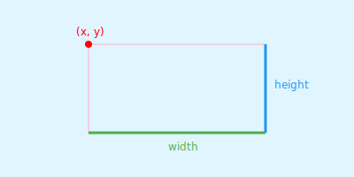
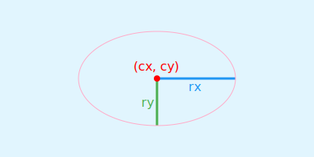

# SVG 基本图形

SVG 中基本图形包括直线、折线、矩形、圆形、椭圆、多边形。

## 直线 `<line>`


```html
<line x1="100" y1="100" x2="300" y2="100"/>
```
- `x1, y1`：表示直线起点的横坐标和纵坐标。
- `x2, y2`：表示直线终点的横坐标和纵坐标。

## 折线 `<polyline>`


```html
<polyline points="100, 150 150, 50 200, 100 250, 50 300, 100"/>
```
- `points`：表示折线每个端点的坐标。横坐标与纵坐标之间用逗号分隔，点与点之间用空格分隔。

## 矩形 `<rect>`



```html
<rect x="100" y="50" width="200" height="100" />
```

- x, y：表示矩形左上角端点的横坐标和纵坐标。
- width：表示矩形的宽。
- height：表示矩形的高。

## 圆 `<circle>`


```html
<circle cx="200" cy="100" r="80"/>
```

- cx, cy：表示圆的圆心的横坐标和纵坐标。
- r：表示圆的半径。

## 椭圆 `<ellipse>`



```html
<ellipse cx="200" cy="100" rx="100" ry="60"/>
```

- cx, cy：表示椭圆中心的横坐标和纵坐标。
- rx：表示椭圆横向轴的半径。
- ry：表示椭圆纵向轴的半径。


## 多边形 `<polygon>`


```html
<polygon points="100, 150 150, 50 200, 100 250, 50 300, 100"/>
```

- `points`：表示多边形每个端点的坐标。横坐标与纵坐标之间用逗号分隔，点与点之间用空格分隔。