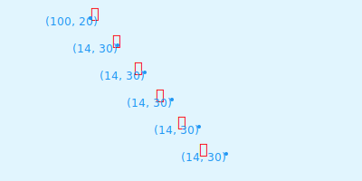

# SVG 文本

SVG 中文本相关的元素包括 `<text>`、`<tspan>`、`<textPath>`。

## `<text>` 元素


```html
<text x="150" y="100" fill="red">这是一段文本</text>
```
### 特性

- x 与 y

用于指定文本（第一个文字）的横坐标和纵坐标


```html
<text x="150" y="100" fill="red">这是一段文本</text>
```
另外，`x` 与 `y` 特性取值也可以是个数列。每个数值表示对应文字的横坐标和纵坐标

```html
<text x="100 130 160 190 220 250" y="20 50 80 110 140 170" fill="red">这是一段文本</text>
```


- dx 与 dy

`dx`、`dy` 与 `x`、`y` 作用很类似。只是 `x`、`y` 是绝对坐标，而 `dx`、`dy` 是相对于 `(0, 0)` 进行计算。


```html
<text dx="150" dy="100" fill="red">这是一段文本</text>
```

同样， `dx` 与 `dy` 特性取值也可以是个数列。第一个文字相对于 `(0, 0)`，第二个文字相对于第一个文字的坐标，依次类推进行计算。



```html
<text dx="100 14 14 14 14 14" dy="20 30 30 30 30 30" fill="red">这是一段文本</text>
```

- rotate

`rotate` 特性可用文字的旋转


```html
<text x="150" y="100" fill="red" rotate="60">这是一段文本</text>
```
同样，`rotate` 特性的取值也可以是个数值，表示对应文字的旋转角度。


```html
<text x="150" y="100" fill="red" rotate="-90 -60 -30 0 30 60">这是一段文本</text>
```

- textLength 与 lengthAdjust

`textLength` 与 `lengthAdjust` 是密切相关的两个属性，用于设置文本的长度、字间距及字形。

- `textLength`：设置文本的长度，默认置为 `none`。
- `lengthAdjust`：设置文本的字间距及字形。
  - `spacing`：字间距，默认值。
  - `spacingAndGlyphs`：字间距及字形。


## `<tspan>` 元素

SVG 中文本不像 HTML 中文本那样能自动换行。如果需要换行，只能使用 `<tspan>` 元素手动实现换行。`<tspan>` 元素 与 `<text>` 元素一样拥有 `x`、`y`、`dx`、`dy`、`rotate`、`textLength`、`lengthAdjust`等特性。


```html
<text class="t" x="160" y="80" fill="red">
  <tspan>这是一</tspan>
  <tspan x="160" dy="20">段文本</tspan>
</text>
```

## `<textPath>` 元素

虽然 SVG 文本不如 HTML 文本那样方便，不过 SVG 使用上更加灵活。如可以将 SVG 文本应用到路径上。`<textPath>` 元素就是将文本应用到路径的元素。


```html
<text class="t" dx="30 30 30 30 30 30" dy="-10" fill="red" >
  <!-- 引用路径 -->
  <textPath xlink:href="#path">这是一段文本</textPath>
</text>
<!-- 定义路径 -->
<path class="path" id="path" d="M100 50C100 150 300 150 300 50" fill="none" stroke="#f1c7c4" />
```